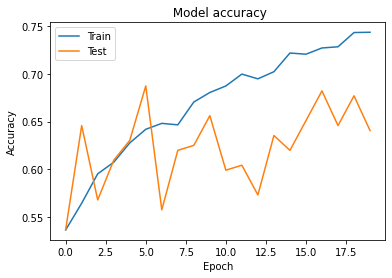
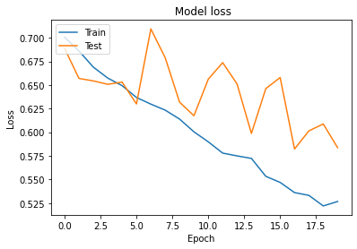

# Mamukka-lalettan-classifier
This is a web app to classify whether an image is of Mamukka or Lalettan. The user need to input a image and the web app will predict that whether the image is of Mammuka or Lalattan.We have trained a CNN model for making the predictions. This Project is created as a Part of *TinkerHub Build-From-Home*.

### **Demo of the project -** See the product walkthrough [here]()

## Dataset used
 - Scraped images of 2 classes(Mammuka&Lalettan) from Google search using selenium automation
 - [Click Here](https://www.kaggle.com/abduladhilpk/mammukalalettan) to get the scraped Data(I have uploaded it in kaggle)

## Libraries&Tech stacks Used:

 - Python Selenium 
  
 - Tensorflow(Keras)

 - Python Flask

 - HTML, CSS& Bootstrap

## Lifecycle of Project till the deployment

 - Scraped data from google using selenium automation
 - Data cleaning & Pre-Processing
 - Deep Learning model building : [Link to the Notebook](./model training/models/notebook/inceptionv3.ipynb)
 - Deployed using Python Flask and hosted on Heroku

## Machine Learning model Evaluation

## Project Created by:

 **Team ID :** BFH/recgv3c8HwoyDEGBA/2021

[Abdul Adhil PK](https://github.com/adhilcodes)

[Mohammed Nazeem C](https://github.com/nazeem-c)
